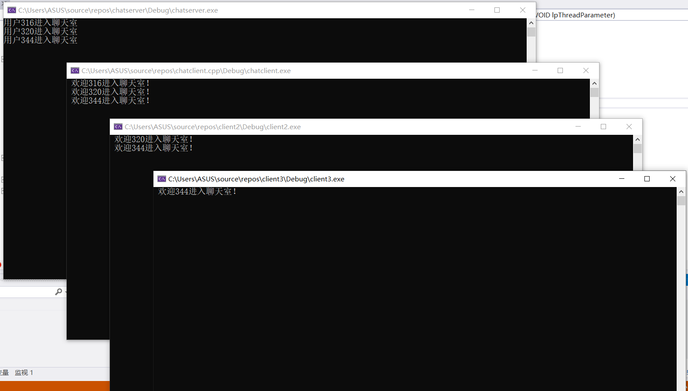
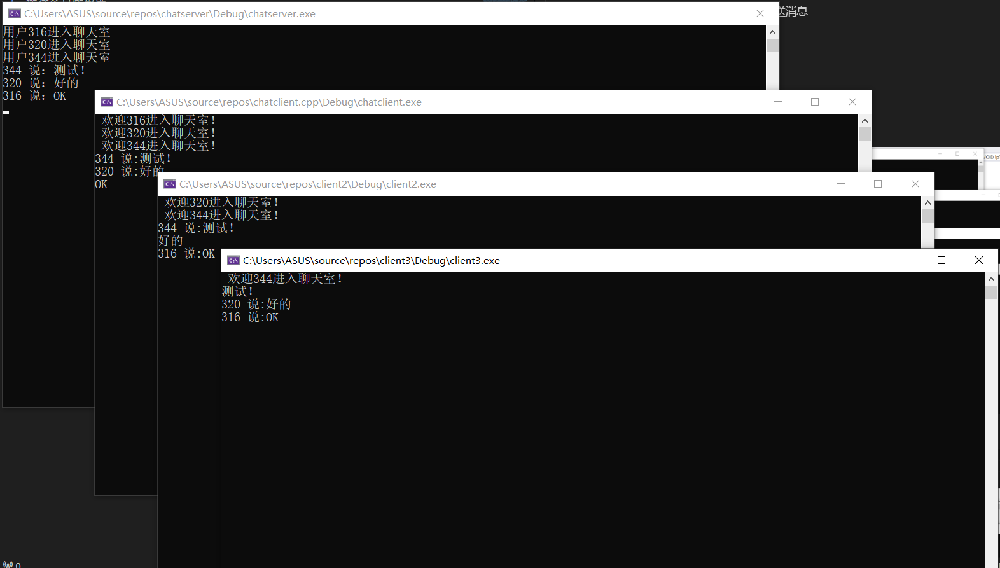
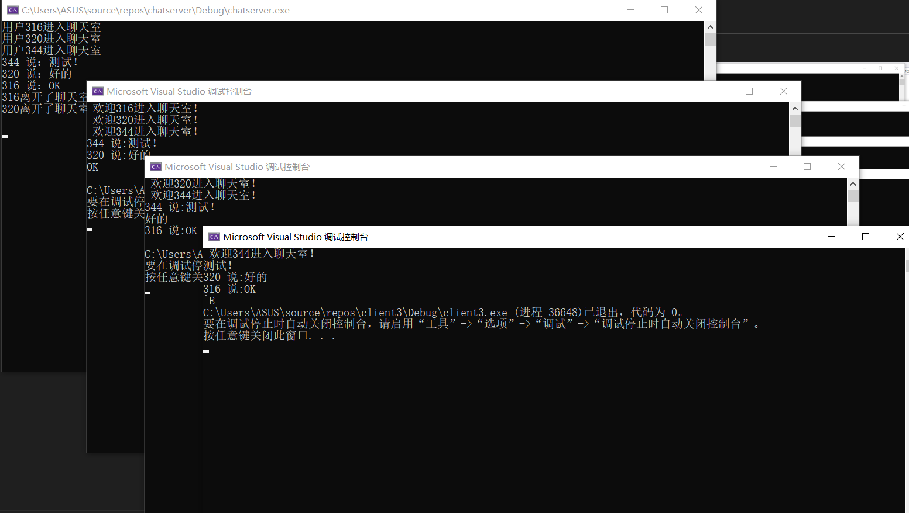
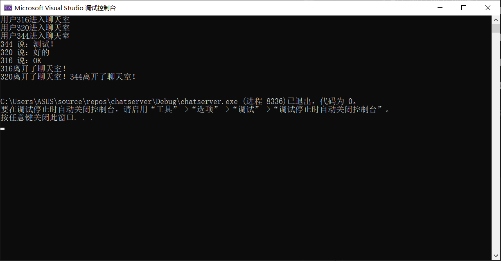

# 计算机网络Lab1实验报告
## 2112079 朱奕翔
## 计算机科学与技术
## [Github链接](https://github.com/boss-server-ops/Network.git)

# 一.协议设计
## (1)消息类型
1.客户端到服务器的消息：客户端发送的消息以字符串形式传输，服务器接收并广播给所有其他客户端。

2.服务器到客户端的消息：服务器将其他客户端发送的消息以相同的字符串形式发送给所有客户端。
## (2)消息语法
* 消息是以字符串的形式传输的，客户端发送的消息和服务器广播的消息都采用字符串格式。
## (3)消息语义
* 客户端发送的消息表示客户端的聊天文本。
* 服务器接收到客户端的消息后，将其广播给所有连接的客户端。
## (4)时序
1. 服务器启动并监听客户端连接。
2. 客户端连接到服务器。
3. 服务器接受新的客户端连接，为每个客户端创建一个单独的线程。
4. 客户端可以发送聊天消息。
5. 服务器接收到客户端的消息后，将其广播给所有其他客户端。
6. 客户端可以随时断开连接。
7. 服务器会广播通知其他客户端有客户端离开。
## (5)完整性
* 该协议在客户端-服务器通信的基础上实现了简单的聊天室功能。它具有基本的消息传输和广播功能。

# 二.各模块功能
## Server
### main函数
服务器端的main函数如下，主要功能为建立与客户端的连接，并创建一个线程来监听键盘，当监听到键盘按下Ctrl+Q后结束程序。在循环中接收客户端的请求，并为这些客户端创建单独的线程来进行消息的传递等。详细的细节在代码注释中体现。
```cpp
int main()
{
	WORD version = MAKEWORD(2, 2);//调用2.2版本的winsock版本
	WSADATA wsadata_address;//WSADATA结构体的实例


	//判断WSA初始化是否成功，如果成功WSAStartup(version, &wsadata_address)会返回0
	//如果返回值不为0，输出WSAStartup() error!提示WSA初始化失败
	if (WSAStartup(version, &wsadata_address) != 0)
	{
		cout << "WSAStartup() error!" << endl;
		return 0;
	}


	//创建套接字
	//socket函数接收三个参数，AF_INET表明协议族使用的是ipv4
	//SOCK_STREAM表明使用的是流式套接字（基于TCP的一种套接字）
	//IPPROTO_TCP指定协议为TCP传输协议
	SOCKET slisten = socket(AF_INET, SOCK_STREAM, IPPROTO_TCP);

	

	//如果套接字句柄未成功分配或初始化，返回值为-1，与宏定义的INVALID_SOCKET进行相同，输出socket error !并终止程序
	if (slisten == INVALID_SOCKET)
	{
		cout << "socket error !" << endl;
		return 0;
	}
	//sockaddr_in是一个结构体，初始化这个结构体的实例，方便后续socket绑定IP和端口

	sockaddr_in sin;//ipv4的指定方法是使用struct sockaddr_in类型的变量
	sin.sin_family = AF_INET;//地址族为IPV4
	sin.sin_port = htons(8000);//设置端口。sin_port为16位二进制的端口号，htons将主机的unsigned short int转换为网络字节顺序
	inet_pton(AF_INET, "192.168.239.1", &sin.sin_addr.s_addr);
	//bind函数的作用是将socket和ip地址以及端口进行绑定
	//第一个参数是声明过的socket
	//第二个参数sin原本是sockaddr_in的类型，&sin就是取sin的地址，（LPSOCKADDR）其实是struct sockaddr* 的类型别名，做了一个类型转换，sockaddr_in常用于socket定义和赋值,sockaddr用于函数参数
	//第三个参数是要绑定的地址结构体的大小
	if (bind(slisten, (LPSOCKADDR)&sin, sizeof(sin)) == SOCKET_ERROR)
	{
		printf("bind error !");
	}

	//开始监听
	//listen是服务器端才需要使用的函数，用来监听指定的socket地址
	//第二个参数表示允许排队的最大数目
	//如果监听失败提示监听错误
	if (listen(slisten, 5) == SOCKET_ERROR)
	{
		cout << "listen error !" << endl;
		return -1;
	}

	SOCKET sclient;
	sockaddr_in sinclient;
	int len = sizeof(sinclient);
	char recData[255];
	
	HANDLE hThread = CreateThread(NULL, 0, ThreadListenKey, 0, 0, NULL);
	CloseHandle(hThread); // 关闭对线程的引用
	while (true)
	{
		
		
		//accept函数用来接收客户端的请求
		//第一个参数为服务器本地的套接字
		//第二个参数为客户端的套接字地址结构体的地址
		//第三个表示套接字地址结构体的大小
		//返回值发生错误时返回INVALID_SOCKET，未发生错误时返回socket套接字
		SOCKET c = accept(slisten, (SOCKADDR*)&sinclient, &len);

		//如果成功得到套接字的描述符
		if (c != INVALID_SOCKET)
		{
			// 创建线程，并且传入与client通讯的套接字
			HANDLE hThread = CreateThread(NULL, 0, ThreadFun, (LPVOID)c, 0, NULL);
			CloseHandle(hThread); // 关闭对线程的引用
		}

	}
	closesocket(slisten);
	WSACleanup();
	return 0;
}
```

### ThreadFun函数
这个函数是一个线程函数，在主函数中循环每接收到来自客户端的请求后就会单独分配一个线程，这个线程就会调用这个函数来进行通信，在主函数中会传递客户端的socket，而这个线程函数的任务就是通过传递进来的socket来进行服务器端和该客户端的通信以及广播消息给其他客户端。当有客户成功进入聊天室和离开聊天室的时候也会在服务器中显示哪个客户进行了相应的操作。
```cpp
DWORD WINAPI ThreadFun(LPVOID lpThreadParameter)
DWORD WINAPI ThreadFun(LPVOID lpThreadParameter)
{
	SOCKET c = (SOCKET)lpThreadParameter;//将传入的参数类型转换为SOCKET

	socketlist.push_back(c);//将该socket加入列表中，方便服务器端对客户端进行消息广播

	cout << "用户" << c << "进入聊天室" << endl;
	char welcome[300] = { 0 };
	sprintf_s(welcome, " 欢迎%d进入聊天室！", c);

	//广播有客户进入了聊天室
	for (SOCKET client : socketlist)
	{
		//send函数用来发送数据
		//第一个参数为接收方的套接字
		// 第二个参数为发送数据的缓冲区的指针
		// 第三个参数为指定发送的大小
		// 第四个参数设置是否发送带外数据等
		
			send(client, welcome, 300, 0);
		

	}
	int ret = 0;
	while (true)
	{
		char sentence[255] = { 0 };
		//rec函数用来接收数据
		//返回值为0表示已经断开链接，返回SOCET_ERROR表示发生错误，成功则返回接收的字节数
		ret = recv(c, sentence, 255, 0);
		if (ret == SOCKET_ERROR || ret == 0)
		{
			break;
		}
		cout << c << " 说：" << sentence << endl;
		char vocalize[300];
		sprintf_s(vocalize, "%d 说:%s", c, sentence);

		//广播有新的消息
		for (int i=0;i<socketlist.size();i++)
		{
			
			SOCKET client = socketlist[i];
			if (client != c)
			{
				//send函数用来发送数据
				//第一个参数为接收方的套接字
				// 第二个参数为发送数据的缓冲区的指针
				// 第三个参数为指定发送的大小
				// 第四个参数设置是否发送带外数据等
				
				send(client, vocalize, 300, 0);
			}
		}
	}
	


	cout << c << "离开了聊天室！"<<endl;

	char leave[300] = { 0 };
	sprintf_s(leave, " %d 离开了聊天室！", c);

	//广播有客户离开了聊天室
	for (SOCKET client : socketlist)
	{
		//send函数用来发送数据
		//第一个参数为接收方的套接字
		// 第二个参数为发送数据的缓冲区的指针
		// 第三个参数为指定发送的大小
		// 第四个参数设置是否发送带外数据等
		if (c != client)
		{
			send(client, leave, 300, 0);
		}
		
	}

	return 0;
}
```

### ThreadListenKey函数
这个函数用来监听键盘事件，由于键盘上的按键随时可能被按下，所以需要每时每刻都要监听，如果将监听键盘事件的操作放在主函数的循环中，当在执行循环内的其他语句时，就会错过键盘被按下的事件，因此，单独建立一个线程来监听按下键盘的操作。服务器端设置为按下CTRL+Q就会退出程序。
```cpp
DWORD WINAPI ThreadListenKey(LPVOID lpParam)//新的线程用来监听键盘是否按下CTRL+Q来退出
{
	while (true) {
		if (GetAsyncKeyState('Q') & 0x8000 && GetAsyncKeyState(VK_CONTROL) & 0x8000) {
			// 如果按下了Ctrl+E
			exit(0);
		}
	}
	return 0;
}
```
## Client
### main函数
客户端的主函数用来创建socket并与服务器端的IP地址和端口进行连接。客户端不用指定自己的端口，由系统自动分配一个端口号和自身的 ip 地址组合，在 connect() 时由系统随机生成一个。主函数中的循环用来接收用户输入并发送给服务器。

```cpp
int  main()
{

	WORD version = MAKEWORD(2, 2);//调用2.2版本的winsock版本
	WSADATA wsadata_address;//WSADATA结构体的实例


	//判断WSA初始化是否成功，如果成功WSAStartup(version, &wsadata_address)会返回0
	//如果返回值不为0，输出WSAStartup() error!提示WSA初始化失败
	if (WSAStartup(version, &wsadata_address) != 0)
	{
		cout << "WSAStartup() error!" << endl;
		return 0;
	}

	//创建套接字
	//socket函数接收三个参数，AF_INET表明协议族使用的是ipv4
	//SOCK_STREAM表明使用的是流式套接字（基于TCP的一种套接字）
	//IPPROTO_TCP指定协议为TCP传输协议
	SOCKET sclient = socket(AF_INET, SOCK_STREAM, IPPROTO_TCP);


	//如果套接字句柄未成功分配或初始化，返回值为-1，与宏定义的INVALID_SOCKET进行相同，输出socket error !并终止程序
	if (sclient == INVALID_SOCKET)
	{
		cout << "socket error !" << endl;
		return 0;
	}

	sockaddr_in sin;
	sin.sin_family = AF_INET;
	sin.sin_port = htons(8000);
	//sin.sin_addr.s_addr = htonl(INADDR_ANY);
	inet_pton(AF_INET, "192.168.239.1", &sin.sin_addr.s_addr);
	//将本地套接字与服务器端进行连接
	if (connect(sclient, (SOCKADDR*)&sin, sizeof(sockaddr_in)) == SOCKET_ERROR)
	{
		cout << "connect  error" << endl;
		return 0;
	}


	HANDLE hThread = CreateThread(NULL, 0, ThreadFun, (LPVOID)sclient, 0, NULL);//用来接收消息的线程
	CloseHandle(hThread); // 关闭对线程的引用

	HANDLE hThread2 = CreateThread(NULL, 0, ThreadListenKey, 0, 0, NULL);//监听键盘事件的线程
	CloseHandle(hThread); // 关闭对线程的引用

	int  ret = 0;
	do
	{
		char message[255] = { 0 };
		cin >> message;
		ret = send(sclient, message, 255, 0);
	} while (ret != SOCKET_ERROR && ret != 0);


	closesocket(sclient);


	WSACleanup();


	return 0;
}
```
### ThreadFun函数
因为要随时接收来自服务器广播的来自其他客户端的消息等，所以需要一个单独的线程用来接收服务器发来的消息。
```cpp
DWORD WINAPI ThreadFun(LPVOID lpThreadParameter)
{
	SOCKET c = (SOCKET)lpThreadParameter;//将传入的参数类型转换为SOCKET
	int ret = 0;
	do
	{
		char recData[300] = { 0 };
		recv(c, recData, 300, 0);
		cout << recData << endl;
	} while (true);
	return 0;
}
```
### ThreadListenKey函数
与服务器端的监听键盘函数一样，客户端也有按键退出程序的功能。按下CTRL+E就能正常退出程序。
```cpp
DWORD WINAPI ThreadListenKey(LPVOID lpParam)
{
	while (true) {
		if (GetAsyncKeyState('E') & 0x8000 && GetAsyncKeyState(VK_CONTROL) & 0x8000) {
			// 如果按下了Ctrl+E
			exit(0);
		}
	}

	return 0;
}
```
# 三.程序界面展示及运行说明
## 如何运行
1. 运行服务器端的程序

2. 运行客户端程序

3. 客户端输入消息，按下回车键发送消息

4. 按下CTRL+E退出客户端程序

5. 按下CTRL+Q退出服务器端程序

## 运行界面及结果
1. 运行服务器端和客户端程序之后


2. 当一个客户端发送消息后，其他客户端和服务器都能收到消息（支持中英文）并打印


## 退出运行
1. 客户端按下CTRL+E退出程序
    
2. 服务器端按下CTRL+Q退出程序
    

## 运行逻辑合理性
1. 需要先启动服务器再启动客户端，符合正常聊天程序的启动过程
2. 当有用户进入聊天室时，服务器以及其他在聊天室的用户能够正常收到有用户进入聊天室的信息。
3. 当有用户发消息时，其他客户端以及服务器都能看到是谁发了什么消息
4. 当有客户端按键退出程序时会通知服务器该用户离开聊天室
5. 当有用户退出聊天室时，其他用户以及服务器都能看到哪个用户退出了聊天室

# 四.实验过程中遇到的问题及分析
## 服务器端该如何面对随时可能到来的客户端请求
服务器端主函数中有一个循环用来接收来自客户端的请求，并创建单独的线程来进行消息的传递
## 各个客户端之间并不能直接连接，那么一个客户端发出的信息应该如何传递给其他客户端
虽然各个客户端之间并不能直接连接，但是客户端可以通过服务器来进行消息的传递，用vector存储所有与服务器进行了连接的socket，当服务器收到来自某一个客户发送来的信息后，通过遍历这个socket动态数组来将这个信息转发给所有其他客户端，就能实现群聊的功能。
## 如何监听键盘事件来进行退出程序的操作
最初我将这段代码放在主函数的循环中，但实际上并不能实现每时每刻来进行监听键盘事件的操作，从问题出发，要每时每刻监听所以单独创建一个线程来监听键盘事件。当这个线程监听到按了对应的按键，就退出程序。
```cpp
if (GetAsyncKeyState('Q') & 0x8000 && GetAsyncKeyState(VK_CONTROL) & 0x8000) {
			// 如果按下了Ctrl+Q
			exit(0);
		}
```