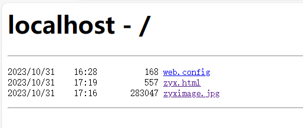
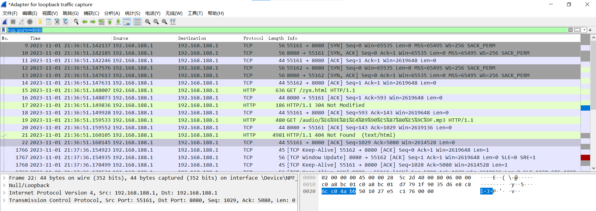
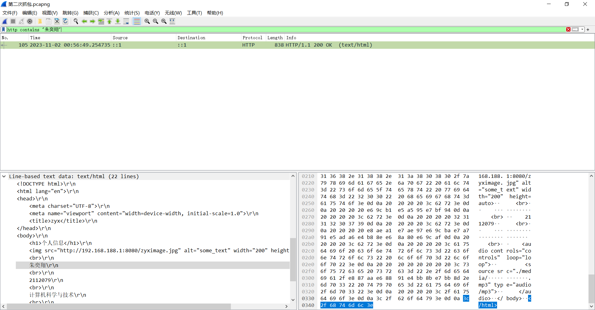
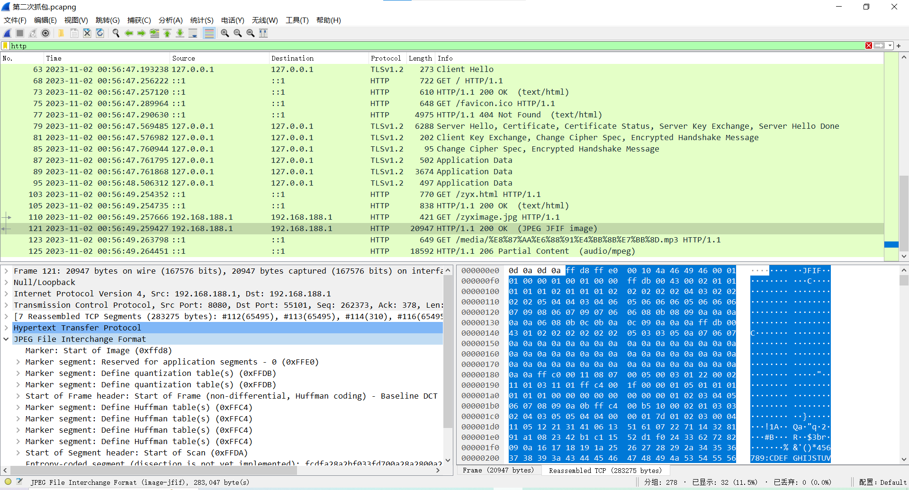
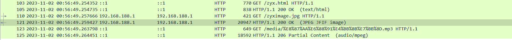
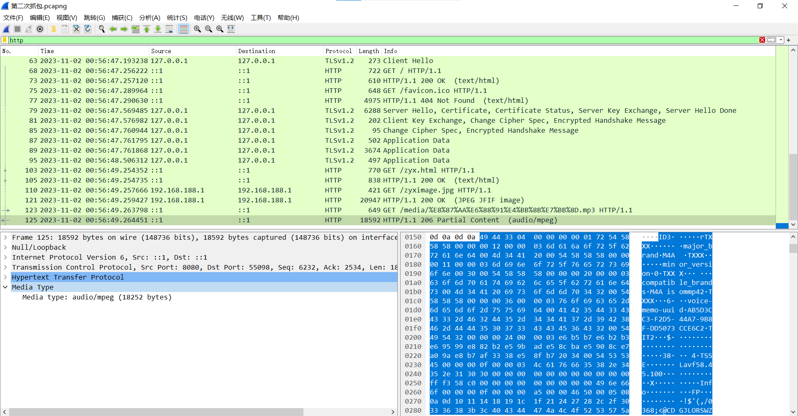

# 计算机网络第二次编程作业
2112079
朱奕翔
计算机科学与技术
## 实验要求
（1）搭建Web服务器（自由选择系统），并制作简单的Web页面，包含简单文本信息（至少包含专业、学号、姓名）、自己的LOGO、自我介绍的音频信息。页面不要太复杂，包含要求的基本信息即可。

（2）通过浏览器获取自己编写的Web页面，使用Wireshark捕获浏览器与Web服务器的交互过程，并进行简单的分析说明。

（3）使用HTTP，不要使用HTTPS。

（4）提交实验报告。
## 一、搭建Web服务器
在本机上搭建Web服务器，设置的端口为8080，搭建好之后访问http://localhost:8080/出现如下界面表明搭建成功


## 二、制作简单的Web页面并通过浏览器浏览
利用vscode和相关插件能够快速制定html框架，在body部分填入自己的个人信息，照片，自我介绍的音频信息等。html文件存在搭建服务器时设定的文件夹内，这样在访问上述网站时就能选择访问该网页。一个简单的Web页面制作完成，并如图所示成功通过浏览器进行浏览。
```html
<!DOCTYPE html>
<html lang="en">
<head>
    <meta charset="UTF-8">
    <meta name="viewport" content="width=device-width, initial-scale=1.0">
    <title>zyx</title>
</head>
<body>
    <h1>个人信息</h1>
    
    <br>
    朱奕翔
    <br>
    2112079
    <br>
    计算机科学与技术
    <br>
    <audio controls="controls" loop="loop">
        <source src="./media/自我介绍.mp3" type="audio/mp3">
    </audio>
</body>
</html>
```

## 三、Wireshark捕获Web浏览器和服务器的交互过程
1. 由于是在本机搭建的服务器，通过本机主机的内部通信，而不经过物理网络，因此通过Adapter for loopback traffic capture网络适配器来进行抓包。通过加入过滤条件tcp.port==8080能够清晰地看到与8080端口有关的交互过程。


2. 建立连接的过程称为“三次握手”

    (1) 以55161端口与8080端口建立连接为例，第一次握手客户端发送 SYN 报文到服务器。
    
    (2) 第二次 ，服务器接收到 客户端的SYN 报文，回复 SYN + ACK 报文。
    
    (3) 第三次 ，客户端接收到服务端的 SYN+ACK 报文后，回复 ACK报文
    


3. 断开连接的过程称为“四次挥手”

    (1)客户端A发送一个FIN，用来关闭客户A到服务器B的数据传送。
    
    (2)服务器B收到这个FIN，它发回一个ACK，确认序号为收到的序号加1。和SYN一样，一个FIN将占用一个序号。
    
    (3)服务器B关闭与客户端A的连接，发送一个FIN给客户端A。
    
    (4)客户端A发回ACK报文确认，并将确认序号设置为收到序号加1。
    

4. “三次握手”和“四次挥手”总结

    由于TCP是全双工的，为了确保建立连接和断开连接成功，分别需要“三次握手”和“四次挥手”使得客户端和服务器端都能够得知对方已与自己建立或断开连接。

5. 获取html文本

    通过加入过滤条件http contains "朱奕翔"可以快速定位到成功从服务器发送到客户端的html数据包，将过滤条件改为http就能看到客户端向服务器发送的请求，如图所示是客户端先向客户端发送的请求，之后客户端返回文本形式html内容，200 OK表示成功返回。
    
    这张图的左下角可以看到数据可以看到返回的text正是编写的html文件中的内容，进一步验证了返回成功。
    

6. 获取图片

    同理，客户端也请求了图片，也成功得到了回应
    
    能够清楚地看到图片的十六进制数据。
    

7. 获取流媒体

    随着获取得到文本和图片之后，紧接着就请求了其中的流媒体文件，在这个网页中是音频，可以看到206 partial content代表的是部分资源请求成功，常用于流媒体，在这里说明流媒体返回成功。
    
    返回的十六进制内容如下所示
    

## 总结
1. 搭建服务器和制作简单的文件在搜索相关资料学习后比较简单，但是也只是浅尝辄止，html可以制作出精美的网页。
2. wireshark抓包初次使用有些困难，但通过不断摸索，熟悉里面的各种功能，尤其是过滤条件的语法可以快速找到想要获取的捕获的内容。
3. 在使用时遇到了搜索不到html文本内容的包的情况，只能找到http 304 not modified这种响应，最终得知是为了提高性能和减少带宽消耗采用的缓存的机制，当服务器内容未发生变化时不需要重新发送资源内容。所以清空缓存重新抓包就得到了http 200 OK的响应，也能通过http contains "朱奕翔"这个过滤条件直接找到返回的报文。